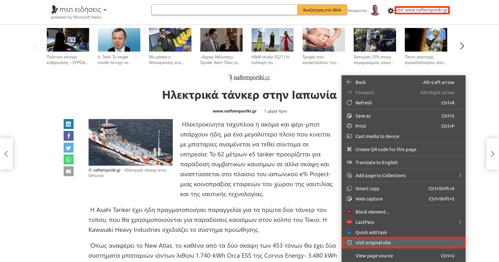

# Microsoft news extension

Mircosoft news extension adds user the ability to navigate to the original news page from msn.com.

## Installation
- Clone the repository using the command `git clone https://github.com/ntellos13/msn-news-extension` and checkout the `master` branch.
- [Load unpacked](https://docs.microsoft.com/en-us/microsoft-edge/extensions-chromium/getting-started/extension-sideloading) the extension located in `chrome` folder in MS edge browser